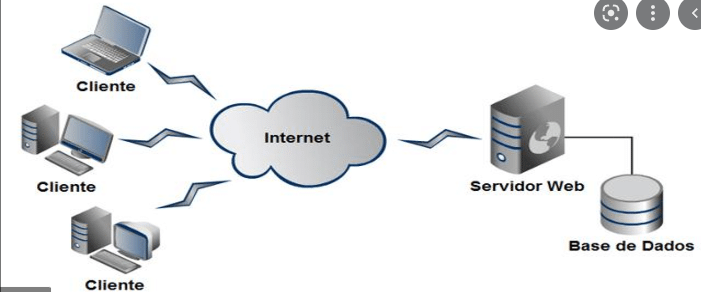

# 1. Banco de Dados

Bancos de dados são ferramentas utilizadas para armazenamento e consulta de dados pelos softwares;

---

 

# 2. Sumário
 

- [1. Banco de Dados](#1-banco-de-dados)
- [2. Sumário](#2-sumário)
- [3. Introdução a Banco de dados](#3-introdução-a-banco-de-dados)
  - [3.1. Dado e Informação](#31-dado-e-informação)
  - [3.2. Banco de Dados Relacional(SQL) x Não Relacional(NoSQL)](#32-banco-de-dados-relacionalsql-x-não-relacionalnosql)
    - [3.2.1. Banco de Dados Relacional](#321-banco-de-dados-relacional)
    - [3.2.2. Banco de Dados Não Relacional](#322-banco-de-dados-não-relacional)
  - [3.3. Arquitetura Cliente-Servidor](#33-arquitetura-cliente-servidor)
- [4. Modelagem de Dados](#4-modelagem-de-dados)
  - [4.1. Modelagem Conceitual, Lógica e Física](#41-modelagem-conceitual-lógica-e-física)
    - [4.1.1. Modelo conceitual](#411-modelo-conceitual)
    - [4.1.2. Modelo Lógico](#412-modelo-lógico)
    - [4.1.3. Modelo Físico](#413-modelo-físico)
  - [4.2. Normalização de dados](#42-normalização-de-dados)
    - [4.2.1. Primeira Forma Normal](#421-primeira-forma-normal)
    - [4.2.2. Segunda Forma Normal](#422-segunda-forma-normal)
    - [4.2.3. Terceira Forma Normal](#423-terceira-forma-normal)
    - [4.2.4. Outras Formas Normais](#424-outras-formas-normais)

---

 

# 3. Introdução a Banco de dados

## 3.1. Dado e Informação
 

**Dado** -> Elemento bruto, geralmente proveniente de uma entrada do usuário ou de outros sistemas;
- Pode ser impossível saber o significado de um dado bruto;

Ex.:
. | .
----|---
1200|100
Oeste|Ricardo alves
79154| Sapatos

**Informação** -> Elemento processado/lapidado constituído de dados;
- Conjunto de dados em um contexto, sendo possível obter informações a partir destes;

Ex. tomando como base os dados acima:

Relatório mensal de venda | - | Região Oeste
-----|--------|-------
Vendedor| Ricardo Alves
Código do Empregado | 79154
|  |
Item| Quantidade | Preço Unitário
Sapatos|1200|100

Veja que agora é possível obter informações a partir dos dados organizados e tratados.

-----

 

## 3.2. Banco de Dados Relacional(SQL) x Não Relacional(NoSQL)
 

- SQL - Structure Query Language (linguagem de consulta estruturada);
- NoSQL - Not only SQL(podem ou não usar o SQL, ou ter comandos diferentes)
- Existem tipos diferentes de bancos de dados, cada um com suas características, vantagens e desvantagens;

---
 

### 3.2.1. Banco de Dados Relacional
 

- Conceito criado por **Edgar Frank Codd**, 1970;
- Dados armazenados entre tabelas que podem estar relacionadas ou não;
- Os SGBDRs (Sistemas Gerenciadores de Bancos de Dados),oferece aos usuários processos de validação, verificação e garantia de integridades dos dados.
- Oferecem controle de concorrência, recuperação de falhas e segurança, controle de transações, otmização de consulta etc.
  
**Pontos fracos**

- Dificuldade em conciliar o modelo relacional com a demanda por escalabilidade;
- Dificuldade em organizar os dados em umsistema distribuído trabalhando com particionamento de dados.

**Principais Bancos SQL**

- SQL Server;
- MySQL;
- SQLite
- Oracle Database
- PostgreSQL
- etc.

----

 

### 3.2.2. Banco de Dados Não Relacional
 

- Surgiu em 1998, a partir de uma solução de banco de dados que não oferecia uma interface SQL. Posteriormente o termo NoSQL passou a representar soluções que promoviam uma alternativa ao modelo relacional.
- Sua vantagem é a Performance, por não utilizar um modelo estruturado, consegue-se trabalhar com os dados de maneira mais rápida;
- Promovem alta disponibilidade e maior escalabilidade;

**Algumas implementações oferecem:**

- Particionamento e replicação dos dados;
- Sistemas baseados em armazenamento chave/valor;
- Sistemas orientados a documentos;
- Sistemas orientados a coluna;
- Sistemas baseados em grafos;
- etc.

**Principais Bancos NoSQL**

- MongoDB;
- Redis;
- Oracle Coherence;
- elasticsearch;
- Firebase
- etc.

-----
 

## 3.3. Arquitetura Cliente-Servidor
 

A arquitetura Cliente-Servidor nada mais é do que um cliente(navegador) fazendo requisições para servidores. Estes buscam o que foi requisitado no banco de dados e devolvem as informações para os clientes;

----
 

# 4. Modelagem de Dados
 

## 4.1. Modelagem Conceitual, Lógica e Física
 

Os modelos são usados para descrever detalhadamente a estrutura de um banco de dados.

Servem com parte importante da documentação de sistemas, auxiliam desenvolvedores e podem ser entregues ao cliente que contratou o serviço de desenvolvimento.

**Atenção**: Um modelo de dados não informa os dados armazenados, somente quais e que tipos de dados contém.

São divididos em três níveis: **Conceitual, Lógico e Físico**;

----
 

### 4.1.1. Modelo conceitual
 

----
 

### 4.1.2. Modelo Lógico
 

----

 

### 4.1.3. Modelo Físico
 

----

 

## 4.2. Normalização de dados
 

----
 

### 4.2.1. Primeira Forma Normal
 

----
 

### 4.2.2. Segunda Forma Normal
 

----
 

### 4.2.3. Terceira Forma Normal
 

----
 

### 4.2.4. Outras Formas Normais
 

----
