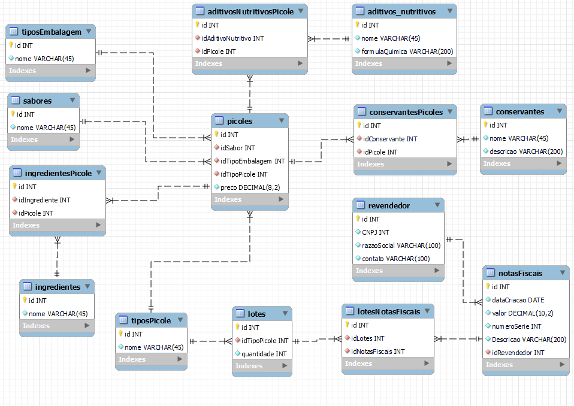

# 1. Banco de Dados

Bancos de dados são ferramentas utilizadas para armazenamento e consulta de dados pelos softwares;

---

 

# 2. Sumário
 

- [1. Banco de Dados](#1-banco-de-dados)
- [2. Sumário](#2-sumário)
- [3. Introdução a Banco de dados](#3-introdução-a-banco-de-dados)
  - [3.1. Dado e Informação](#31-dado-e-informação)
  - [3.2. Banco de Dados Relacional(SQL) x Não Relacional(NoSQL)](#32-banco-de-dados-relacionalsql-x-não-relacionalnosql)
    - [3.2.1. Banco de Dados Relacional](#321-banco-de-dados-relacional)
    - [3.2.2. Banco de Dados Não Relacional](#322-banco-de-dados-não-relacional)
  - [3.3. Arquitetura Cliente-Servidor](#33-arquitetura-cliente-servidor)
- [4. Modelagem de Dados](#4-modelagem-de-dados)
  - [4.1. Modelagem Conceitual, Lógica e Física](#41-modelagem-conceitual-lógica-e-física)
    - [4.1.1. Modelo conceitual](#411-modelo-conceitual)
    - [4.1.2. Modelo Lógico](#412-modelo-lógico)
    - [4.1.3. Modelo Físico](#413-modelo-físico)
  - [4.2. Conceitos essenciais](#42-conceitos-essenciais)
  - [4.3. Normalização de dados](#43-normalização-de-dados)
    - [4.3.1. Primeira Forma Normal (1FN)](#431-primeira-forma-normal-1fn)
    - [4.3.2. Segunda Forma Normal (2FN)](#432-segunda-forma-normal-2fn)
    - [4.3.3. Terceira Forma Normal (3FN)](#433-terceira-forma-normal-3fn)
    - [4.3.4. Outras Formas Normais](#434-outras-formas-normais)
  - [4.4. MER - Modelo Entidade Relacionamento](#44-mer---modelo-entidade-relacionamento)
- [5. Linguagem SQL](#5-linguagem-sql)
  - [5.1. DQL - Data Query Language](#51-dql---data-query-language)
  - [5.2. DML - Data Manipulation Language](#52-dml---data-manipulation-language)
  - [5.3. DDL - Data Definition Language](#53-ddl---data-definition-language)
  - [5.4. DCL - Data Control Language](#54-dcl---data-control-language)
  - [5.5. DTL - Data Transaction Language](#55-dtl---data-transaction-language)

---

 

# 3. Introdução a Banco de dados

## 3.1. Dado e Informação
 

**Dado** -> Elemento bruto, geralmente proveniente de uma entrada do usuário ou de outros sistemas;
- Pode ser impossível saber o significado de um dado bruto;

Ex.:
. | .
----|---
1200|100
Oeste|Ricardo alves
79154| Sapatos

**Informação** -> Elemento processado/lapidado constituído de dados;
- Conjunto de dados em um contexto, sendo possível obter informações a partir destes;

Ex. tomando como base os dados acima:

Relatório mensal de venda | - | Região Oeste
-----|--------|-------
Vendedor| Ricardo Alves
Código do Empregado | 79154
|  |
Item| Quantidade | Preço Unitário
Sapatos|1200|100

Veja que agora é possível obter informações a partir dos dados organizados e tratados.

-----

 

## 3.2. Banco de Dados Relacional(SQL) x Não Relacional(NoSQL)
 

- SQL - Structure Query Language (linguagem de consulta estruturada);
- NoSQL - Not only SQL(podem ou não usar o SQL, ou ter comandos diferentes)
- Existem tipos diferentes de bancos de dados, cada um com suas características, vantagens e desvantagens;

---
 

### 3.2.1. Banco de Dados Relacional
 

- Conceito criado por **Edgar Frank Codd**, 1970;
- Dados armazenados entre tabelas que podem estar relacionadas ou não;
- Os SGBDRs (Sistemas Gerenciadores de Bancos de Dados),oferece aos usuários processos de validação, verificação e garantia de integridades dos dados.
- Oferecem controle de concorrência, recuperação de falhas e segurança, controle de transações, otmização de consulta etc.
  
**Pontos fracos**

- Dificuldade em conciliar o modelo relacional com a demanda por escalabilidade;
- Dificuldade em organizar os dados em umsistema distribuído trabalhando com particionamento de dados.

**Principais Bancos SQL**

- SQL Server;
- MySQL;
- SQLite
- Oracle Database
- PostgreSQL
- etc.

----

 

### 3.2.2. Banco de Dados Não Relacional
 

- Surgiu em 1998, a partir de uma solução de banco de dados que não oferecia uma interface SQL. Posteriormente o termo NoSQL passou a representar soluções que promoviam uma alternativa ao modelo relacional.
- Sua vantagem é a Performance, por não utilizar um modelo estruturado, consegue-se trabalhar com os dados de maneira mais rápida;
- Promovem alta disponibilidade e maior escalabilidade;

**Algumas implementações oferecem:**

- Particionamento e replicação dos dados;
- Sistemas baseados em armazenamento chave/valor;
- Sistemas orientados a documentos;
- Sistemas orientados a coluna;
- Sistemas baseados em grafos;
- etc.

**Principais Bancos NoSQL**

- MongoDB;
- Redis;
- Oracle Coherence;
- elasticsearch;
- Firebase
- etc.

-----
 

## 3.3. Arquitetura Cliente-Servidor
 

A arquitetura Cliente-Servidor nada mais é do que um cliente(navegador) fazendo requisições para servidores. Estes buscam o que foi requisitado no banco de dados e devolvem as informações para os clientes;

----
 

# 4. Modelagem de Dados
 

## 4.1. Modelagem Conceitual, Lógica e Física
 

Os modelos são usados para descrever detalhadamente a estrutura de um banco de dados.

Servem com parte importante da documentação de sistemas, auxiliam desenvolvedores e podem ser entregues ao cliente que contratou o serviço de desenvolvimento.

**Atenção**: Um modelo de dados não informa os dados armazenados, somente quais e que tipos de dados contém.

São divididos em três níveis: **Conceitual, Lógico e Físico**;

----
 

### 4.1.1. Modelo conceitual
 

- modelo de mais alto nível, mais próximo da linguagem humana;
- é desenvolvido com alto nível de abstração, a partir dos requisitos do sistema;
- pode ser elaborado de forma textual ou por diagramas de Entidade e Relacionamento e/ou Diagrama de Classes.

----
 

### 4.1.2. Modelo Lógico
 

- Descreve como os dados serão armazenados no banco de dados, e também seus relacionamentos;
- Neste modelo pode ser definida a tecnologia a ser utilizada, Relacional ou não Relacional;

 - Também pode ser apresentado como um tabela, com exemplos de dados;

----

 

### 4.1.3. Modelo Físico
 

- Também chamado de modelo de implementação;
- descreve por meio de alguma linguagem, normalmente SQL, como será feito o armazenamento no banco;
- Aqui é feita a escolha do SGBD, levando em consideração o modelo lógico adotado.

----

 

## 4.2. Conceitos essenciais
 

- **Entidade** - Objeto ou evento do mundo real sobre o qual desejamos manter registros em um banco de dados. Ex.: Carro, Produto, Aluno, Venda...(entidade e tabela são a mesma coisa);
- **Atributo** - Propriedade ou característica que descreve uma entidade. São colunas das tabelas que irão armazenar os dados. Também pode ser chamado de campo;
- **Atributo Chave** - Também conhecido por PK, primary key ou chave primária. É um campo com valor único, não pode se repetir, em todo o conjunto da Entidade. É utilizado como identificador único na tabela;
- **Relacionamentos** - Geralmente as entidades nunca estão sozinhas. Elas são relacionadas a outras entidades. Pode acontecer entre várias entidades;
- **Chave Estrangeira** - Também conhecida por Foreign key ou FK. Semelhante a PK, indica um relacionamento e a chave primária de outra tabela;
- **Grau de Relacionamento** - Indica a quantidade de entidades ligadas a um relacionamento. Pode ser unário, binário, ternário...;
- **Relacionamento Unário** - Uma entidade se relaciona com ela mesma. Ex. Funcionário -> Gerencia (funcionário gerencia outro funcionário);
- **Relacionamento Binário** - Uma entidade se relaciona com outra entidade. Modelo mais comum. Ex.: Vendedor -> Produto, são tabelas diferentes.
- **Relacionamento ternário** - Três entidades estão relacionadas. Ex. Cliente -> Tipo de pagamento -> Vendedor
- **Cardinalidade Máxima** - Quantidade máxima de ocorrências de uma entidade associada a outra entidade. Ex. Uma turma comporta vários alunos (1 : n); Uma entrega tem apenas um endereço de entrega(1 : 1); No caso de muitos para muitos (n : m) são necessárias 3 tabelas;
- **Cardinalidade Mínima** - Define a quantidade mínima de ocorrências, normalmente representadas por 0..1, 1..1, 0..n ou 0..* ('*' significa muitos);
  
---

 

## 4.3. Normalização de dados
 

Normalização de dados é o processo formal que examina o documento descritivo gerado pelos analistas de sistemas durante a análise de requisitos. Busca definir as entidades, atributos, relacionamentos, chaves primárias e chaves estrangeiras do banco de dados a ser modelado.

Esse processo é realizado utilizando regras bem estabelecidas conhecidas como ***Formas Normais***.

Um dos objetivos principais é evitar/amenizar anomalias e inconsistências que podem ocorrer durante a inclusão, exclusão, alteração e consulta de registros em bancos de dados.

As vantagens de uma banco de dados normalizado dentro dos padrões é a redução de manutenção, evitar o desperdício de espaço de armazenamento, etc.

Embora existam 5 formas normais, na prática usamos um conjunto de três **Formas Normais**, ou seja, um banco de dados é considerado normalizado se nele foram aplicadas as regras destas três formas normais.

----
 

### 4.3.1. Primeira Forma Normal (1FN)
 

Uma entidade estará na primeira forma normal se todos os campos forem atômicos(simples) e não multivalorados (com múltiplos valores).

Ex.:

Cód_Cliente|Nome|Telefone|Endereço
-----------|----|--------|--------
c001|Fulano de Tal|99999-9999| Rua tal, 00, cidade tal, 123456-789
c002|Ciclano|91111-1111  92222-2222| Rua do ciclano, 00, cidade ciclano, 123456-000

Está em desacordo com a primeira forma normal

- O campo telefone é multivalorado, possui 2 telefones;
- o campo endereço é multivalorado, possui diversos dados;

Para corrigir o problema o campo endereço precisa ser divido em Rua, Número, Bairro e CEP.

Outra solução seria dividir em tabelas diferentes com chaves estrangeiras:

Cód_Cliente|Telefone
-----------|--------
c001|99999-9999
c002|91111-1111
c002|92222-2222

----
 

### 4.3.2. Segunda Forma Normal (2FN)
 

Uma entidade estará na 2FN se ela já se encontrar na 1FN e todos os atributos ***NÃO*** chave forem totalmente dependentes da chave primária.

Ex.:

N_pedido|Cod_Produto|Produto|Quant|Valor_Unit|Subtotal
--------|-----------|-------|-----|----------|--------
1005 | 1-934| Impressora laser| 5 | 1500.00| 7500.00
1006 | 1-956| Impressora matricial| 1 | 190.00 |190.00

Neste caso, tanto o Produto, quanto o Valor_Unit dependem do código do produto e dependem dele. Seria necessário criar outra tabela a parte:

Cod_Produto|Produto|Valor_Unit
-----------|-------|----------
 1-934| Impressora laser| 1500.00
 1-956| Impressora matricial| 190.00

----
 

### 4.3.3. Terceira Forma Normal (3FN)
 

Uma tabela estará na 3FN se estiver na 2FN e se nenhuma coluna ***NÃO*** chave depender de outra coluna ***NÃO*** chave.

Ex.:

N_pedido|Cod_Produto|Quant|Valor_Unit|Subtotal
--------|-----------|-----|----------|--------
1005 | 1-934|  5 | 1500.00| 7500.00
1006 | 1-956|  1 | 190.00 |190.00

- A Coluna Subtotal depende dos valores Quant e Valor_Unit. Como já foi feito no exemplo anterior, Valor_Unit deveria estar junto ao produto e ser removido desta tabela;
- A coluna Subtotal também deve ser removida, visto que através dos dados na tabela cód_produto e Quant ainda é possível obter o valor de Subtotal

N_pedido|Cod_Produto|Quant
--------|-----------|-----
1005 | 1-934|  5 
1006 | 1-956|  1 

----
 

### 4.3.4. Outras Formas Normais
 

Dependendo da complexidade do projeto, apesar de raro, é possível que seja necessário aplicar a 4FN ou 5FN.

- **4FN** - precisa estar na 3FN, a tabela não conter múltiplas entradas multivaloradas (valores repetidos em diferentes colunas):

paciente|plano|exame
-------|-------|----
Murilo | São Camilo| Endoscopia
Murilo | Unimed | Endoscopia
Murilo | São Camilo| Hemograma
Murilo | Unimed| Hemograma

Se realizar uma busca nessa tabela, com as colunas Exame e Plano juntas, retornaria 4 resultados para Murilo, sendo que ele possui apenas 2 planos de saúde. 

Nesse caso seria necessário criar 2 tabelas:

paciente|plano
---|---

e 

paciente|exame
----|---

- **5FN** - Precisa estar na 4FN, e quando um atributo está em outra tabela sem a necessidade de estar na tabela pesquisada, e **pode ser removido sem a perda de nenhuma informação.**

Veja que não é necessária a coluna idProduto(FK) na última tabela. A coluna idFornecedor(FK) já interliga as 3 tabelas, permitindo alcançar a primeira tabela de Produto

----

## 4.4. MER - Modelo Entidade Relacionamento
 

O MER (Modelo Entidade Relacionamento) é utilizado para descrever os objetos do mundo real através de entidades, com suas propriedades que são os atributos e os seus relacionamento.

Abaixo segue imagem com exemplo de tabelas (entidades) e seus relacionamentos:

-----

# 5. Linguagem SQL
 

- SQL significa Structured Query Language (linguagem de consulta estruturada);
- É a linguagem padrão dos Bancos de Dados Relacionais;
- Inspirada na álgebra relacional;
- Podem existir pequenas diferenças nos comandos de um banco para outro;

**SQL se divide em 5 subgrupos**

1. DQL - data query language / consulta de dados;
2. DML - data manipulation language/ manipulação de dados;
3. DDL - data definition language/ definição de dados
4. DCL - data control language/ controle de dados;
5. DTL - data transaction language/ transação de dados.

*Normalmente costumamos escrever os comandos SQL em maiúsculo*.

----

## 5.1. DQL - Data Query Language
 

**Comando**: SELECT
- Utilizado para realizar consultas;
- Muito utilizado, permite especificar a consulta;
- Composto por várias cláusulas e opções, possibilitando elaborar consultas das mais simples as mais complexas.

**Exemplos**:

    SELECT * FROM tipos_produto;

Este comando seleciona todos os dados da tabela "tipos_produto". O asterisco indica que queremos os dados de todos os campos da tabela.

    SELECT codigo, descricao FROM tipo_produto;

Seleciona todos os dados da tabela "tipos_produto" dos campos "codigo" e "descricao".

----

## 5.2. DML - Data Manipulation Language
 

**Comando**: INSERT, UPDATE e DELETE
- Utilizado para realizar inclusões, alterações e exclusões ,respectivamente, de dados;

**Exemplos**:

    INSERT INTO tipos_produto (descricao) VALUES ('Notebook');

Insere o valor 'Notebook', na tabela 'tipos_produto', na coluna 'descricao'.

    INSERT INTO produtos (descricao, preco, codigo_tipo_produto) VALUES ('Notebook', 1200, 1);

Insere os valores 'Notebook', 1200 e 1, na tabela 'produtos', na coluna 'descricao', 'preco' e 'codigo_tipo_produto'.

    UPDATE tipos_produto set descricao = 'Nobreak' WHERE codigo = 3;

Atualiza um registro da tabela 'tipos_produto', a clausula WHERE especifica qual registro deve ser atualizado;

    UPDATE tipos_produto set descricao = 'Nobreak', preco = 2800 WHERE codigo = 3;

Atualiza os registros de 'descricao' e 'preco' na tabela 'tipos_produto' onde o codigo é 20;

    DELETE FROM tipos_produto WHERE codigo =3;

Exclui da tabela 'tipos_produto' o registro que tenha codigo = 3;

***IMPORTANTE!!***

Cuidado com o comando **UPDATE / DELETE**, se não utilizar o WHERE ***todos os dados serão atualizados/ deletados***, comprometendo as informações no banco de dados. A única possibilidade de recuperar alguma informação é se existir um backup.

----

## 5.3. DDL - Data Definition Language
 

**Comandos**: CREATE, ALTER e DROP
- Utilizado para criar, alterar e excluir bancos de dados, tabelas e elementos associados como índice e visão.

**Exemplos**:

    CREATE DATABASE financeiro;

Cria um banco de dados chamado 'financeiro';

    CREATE TABLE tipos_produto(codigo INT PRIMARY KEY, descricao VARCHAR(50));

Cria a tabela chamada 'tipos_produto' contendo os campos codigo, do tipo int e chave primária, e 'descricao' do tipo varchar com até 50 caracteres;

    ALTER TABLE tipos_produto ADD peso DECIMAL(8,2);

Altera a estrutura da tabela 'tipos_produto' acrescentando um campo chamado 'peso', do tipo decimal com 8 digitos antes da vírgula e 2 após;

    DROP TABLE tipos_produto;

Apaga a tabela 'tipos_produto', desde que não tenha relacionamentos;

    DROP DATABASE financeiro;

Apaga o banco de dados financeiro;

---

## 5.4. DCL - Data Control Language
 

**Comandos**: GRANT e REVOKE
- São utilizados para autorizar ou remover um usuários a executar operações no banco de dados;

**Exemplos**:

    GRANT SELECT ON tipos_produto TO geek;

Concede permissão de consulta na tabela tipos_produto ao usuário 'geek';

    REVOKE CREATE TABLE FROM geek;

Remove a permissão de criação de tabelas no banco de dados do usuário 'geek';

## 5.5. DTL - Data Transaction Language
 

**Comandos**: BEGIN, COMMIT e ROLLBACK;
- São utilizados para iniciar ou finalizar uma transação, ou descartar alterações;

**Exemplos**:

    CREATE TABLE 'tipos_produto' (codigo INT PRIMARY KEY, descricao VARCHAR(50));
    BEGIN TRANSACTION; //começo da transação
      INSERT INTO tipos_produtos VALUES ('Notebook');
      INSERT INTO tipos_produtos VALUES ('Nobreak');
    COMMIT; // termina a transação e grava os dados

No exemplo acima, a transação é iniciado com o comando BEGIN, os dados são inseridos e finaliza a transação com o comando COMMIT;

    CREATE TABLE 'tipos_produto' (codigo INT PRIMARY KEY, descricao VARCHAR(50));
    BEGIN TRANSACTION; //começo da transação
      INSERT INTO tipos_produtos VALUES ('Notebook');
      INSERT INTO tipos_produtos VALUES ('Nobreak');
    ROLLBACK; // as inserções acima são desfeitas

Idêntico ao exemplo anterior, mas as alterações são descartadas.

----
